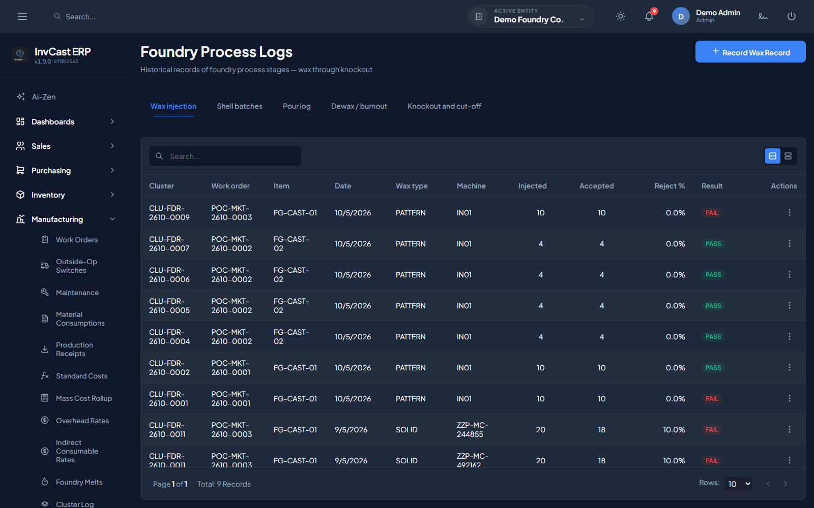
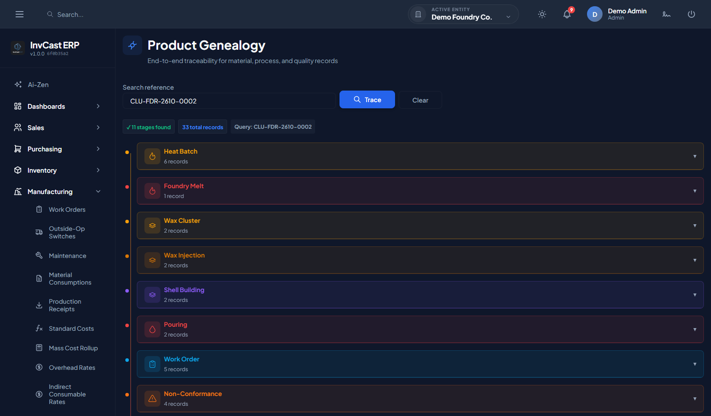
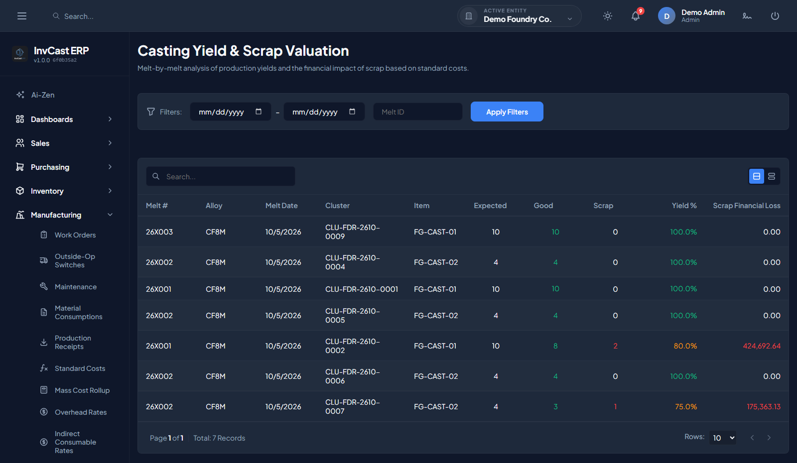
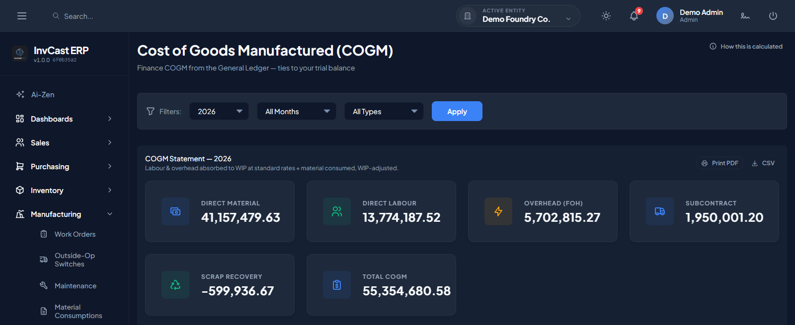
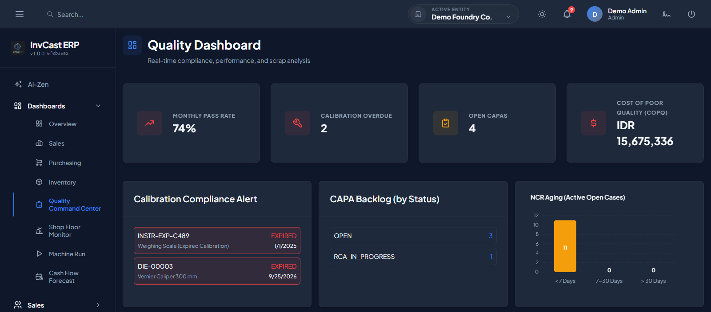
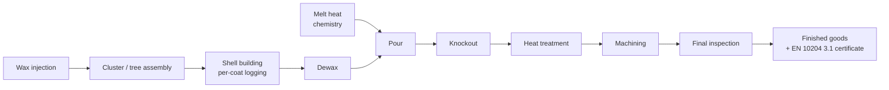
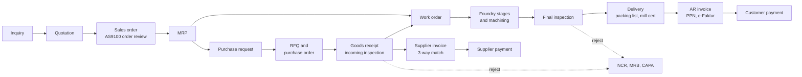
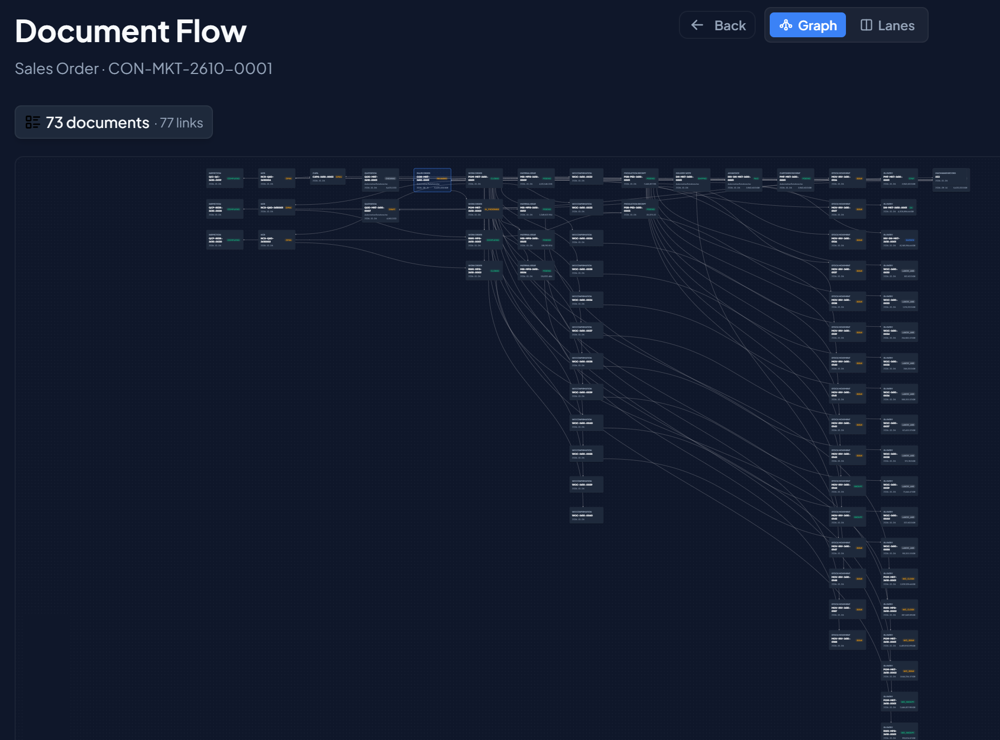
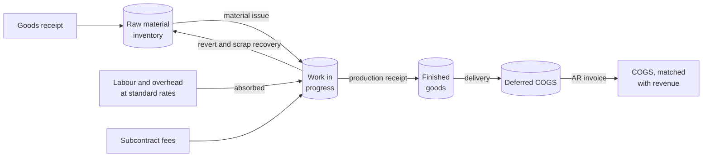
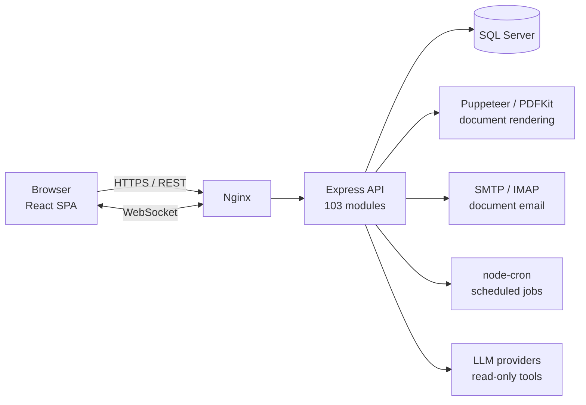

# InvCast ERP

**A full-stack ERP for a precision investment-casting foundry**, covering the whole business from the customer inquiry to the
shipped, certified part and the general ledger behind it.

> The source code is private. This repository describes what the system does, how it is built, and the engineering problems
> it had to solve. A walkthrough or demo is available on request (see [Contact](#contact)).

| | |
|---|---|
|  |  |
| **Product genealogy:** one cluster traced across 11 stages, from heat batch to finished goods | **Casting yield:** melt-by-melt yield, with scrap valued at standard cost |
|  |  |
| **COGM:** built from the general ledger, so it ties to the trial balance | **Quality:** pass rate, calibration status, CAPA backlog, NCR aging |

Screenshots use seeded sample data.

---

## At a glance

| | |
|---|---|
| Backend feature modules | **103** |
| REST endpoints | **~980** (OpenAPI spec generated from source) |
| Reports and dashboards | **37** report pages · **8** dashboards |
| Printable documents | **28** PDF templates (orders, invoices, certificates, travelers, labels) |
| Background jobs | **8** scheduled jobs and alerts |
| Database | **224 tables · 647 foreign keys · 271 CHECK constraints** (SQL Server) |
| Schema migrations | **360+**, versioned and replayable |
| Automated tests | **384** Jest test files · **139** Playwright end-to-end specs |
| Pre-push verification gates | **35** |
| Code | ~200k lines backend JS · ~110k lines frontend |

Figures as of October 2026.

---

## What it covers

| Domain | Highlights |
|---|---|
| **Sales & CRM** | Inquiry pipeline → quotation → sales order → delivery → AR invoice → payment; multi-currency price lists; AS9100 order review; customer complaints and account-health dashboard; new-product introduction stage gates (tooling → wax → shell → casting → NDT → PPAP) |
| **Procurement** | Purchase request → RFQ → PO → goods receipt → supplier invoice with 3-way match and tolerance → payment; landed cost allocation; GR/IR clearing; supplier evaluation and certification |
| **Foundry operations** | The investment-casting process recorded stage by stage (see below), with melt heats tracked down to the poured part |
| **Manufacturing** | BOMs, routings, work centers and machines, work orders, shop-floor confirmation, MRP, subcontracting / outside processing, maintenance (CMMS), tooling and dies |
| **Quality** | Incoming, in-process and final inspection plans; NCR, MRB and CAPA with per-defect disposition; operator certification; calibration; quality certificates |
| **Inventory** | Multi-warehouse and bin locations, lot and heat tracking, shelf-life expiry, stock counts, perpetual stock card |
| **Finance** | Double-entry general ledger fed by every operational module; fiscal period close; multi-currency with FX revaluation; fixed assets; bank reconciliation; withholding tax; standard costing, WIP → COGM → COGS; Indonesian e-Faktur tax export |
| **Platform** | Multi-company tenancy, role-based permissions, configurable approval rules, field-level audit trail, PDF document generation, document email, scheduled jobs and alerts, real-time multi-user sync, an AI assistant with read-only database tools |

### The foundry process it models

Each stage records quantities, scrap and inspection results against the work order. The melt heat follows the part all the way
to the certificate the customer receives.

### How an order flows through the business

The sales order drives MRP, which raises both the work orders and the purchase requests for the material they need. Rejected
material at any inspection opens an NCR, goes to the MRB for disposition, and can raise a CAPA.

In the app, the **document navigator** draws this chain for any real document. Below is one sales order, three links deep:

73 documents and 77 links from a single sales order: quotations, work orders, material issues, operation confirmations,
production receipts, the delivery, the invoice and payment, inspections, NCRs and a CAPA, and the stock movements and journal
entries each one posted.

### How cost flows into the ledger

Every arrow is a journal entry posted by the operational document itself. A goods receipt credits a GR/IR clearing account that
the supplier invoice later clears against AP. A delivery is valued at what the stock ledger actually relieved, not at the item
master's cost, and that value waits in deferred COGS until the invoice recognises revenue and COGS together.

<b>Full feature list</b>

**Sales & CRM**
- Inquiry pipeline with follow-up tracking, quotations, and sales orders with AS9100 order review and customer requirements
- Delivery notes with packing (packages, packing list, commercial invoice), mill certificate and certificate of conformance
- AR invoices with PPN, down-payment invoices and advance application, credit memos, customer payments, RMA
- Customer activities (calls, visits, meetings), CRM dashboard, customer complaints, account-health scoring
- New-product introduction stage gates through PPAP; multi-currency price lists and pricing rules

**Procurement**
- Purchase requests (manual or from MRP), RFQ, purchase orders, goods receipts with incoming inspection
- Supplier invoices with configurable 3-way-match tolerance and variance approval; supplier payments and advances
- Landed-cost shipments and allocation, GR/IR clearing, purchase returns, supplier debit memos
- Supplier certifications, evaluations and scorecard; item–supplier prices and lead times

**Foundry & manufacturing**
- Wax injection, cluster assembly, shell building (per coat), dewax, melt with heat chemistry, pour, knockout and cut-off, heat
  treatment, machining
- Product data management (BOMs and routings), work centers, machines with runs, cycles and batches, work orders, rework orders
- Shop-floor operation queue with QR scanning, confirmation and downtime logging; shop travelers and cluster route cards
- MRP that generates work orders and purchase requests; capacity load
- Subcontracting and outside processing, with approval to switch an operation to a vendor or back in-house
- Maintenance (breakdown and preventive); tooling and dies with ownership, custody and capitalization; tool crib
- Standard costs, mass cost rollup, overhead and indirect-consumable rates, service-department cost allocation
- Product genealogy, and a document navigator that draws how any document connects to the rest

**Quality**
- Inspection plans with characteristics measured at each shop-floor stage; AQL sampling levels
- Incoming, in-process and final inspection with multi-defect disposition; MRB; NCR; CAPA
- NDT records, calibration records and alerts, operator certifications that gate work centers
- Quality certificates, cost of quality, scrap Pareto, supplier scorecard

**Inventory**
- Warehouses and bin locations, stock movements, stock counts, lot and heat tracking, shelf-life expiry, QR labels for items
  and locations

**Finance**
- Chart of accounts, posting profiles routed by business group, journal approvals, posting queue, void center
- Fiscal periods with period and year-end close, opening balances, FX revaluation, budgets, cost centers
- Bank accounts, bank statement import and reconciliation, petty cash, cash-flow forecast
- Fixed assets, withholding tax, e-Faktur export, PPN reconciliation

**Reports (37)**
- Financial: trial balance, profit and loss, balance sheet, GL activity, GL integrity, subledger reconciliation, AR and AP aging
  and outstanding, customer and supplier ledgers, PPN reconciliation, GR/IR reconciliation
- Cost and production: COGM, COGS, cost variance, variance analysis, floor variance, WIP quantity, material issue, rework
  movement, casting yield, revert recovery, scrap Pareto, cost of quality
- Operations: OEE, downtime, capacity load, sales summary, outstanding orders and delivery detail, purchase summary and
  tracking, item price history, fixed-asset mutation and disposal

**Platform**
- Multiple companies, users, roles and permissions, configurable approval rules, KPI targets
- Field-level audit trail, attachments, notifications, real-time updates across users
- 28 printable PDF documents; document email with correspondence history; inbound mailbox polling; scheduled reports
- A public QR verification page for printed documents
- An AI assistant with read-only database tools, where every question and every query it runs is logged

---

## Architecture

- **Backend:** each feature module follows the same `routes → controller → service → validation` structure. Every route passes
  through authentication, permission checks, input validation and audit logging.
- **Frontend:** React 18 with React Query for server state, React Hook Form + Zod for forms, and a shared component library
  (data grid, drawers, form inputs) used by every page.
- **Real time:** write endpoints emit company-scoped Socket.IO events, so open screens refresh when another user changes the data.
- **Delivery:** GitHub Actions runs quality checks, then deploys to a Linux server (PM2 + Nginx).

---

## Hard problems worth talking about

### 1. Making the books tie
Every operational event (a goods receipt, a material issue, a production receipt, a scrap decision, a shipment) posts its own
journal entry. The hard part was not posting but **proving the ledger agrees with the subledgers**: inventory value with the
stock ledger, WIP with open work orders, AR and AP with open documents, in both document currency and base currency. Posted
entries are immutable at the database level, and posting is blocked outside an open fiscal period.

### 2. Multi-company tenancy without leaks
One database serves several companies. Every company-scoped query filters by company; the active company is validated
server-side rather than trusted from the client; document numbers run on per-company sequences; and uniqueness constraints are
scoped per company. All of it was verified by a dedicated tenancy audit.

### 3. Aerospace-grade traceability (AS9100)
A shipped part can be traced back through machining, heat treatment, the pour and the melt heat with its chemistry, and
forward to the customer. That trace generates an **EN 10204 3.1 material certificate**, and printed documents carry a QR code
that verifies them against the database. Approvals enforce segregation of duties (no self-approval), operators must hold valid
certifications to confirm work at certified work centers, and every change records its before and after values.

### 4. Correctness under concurrency
Multi-table postings run in a single database transaction. Write endpoints use optimistic concurrency, so when two users edit
the same document, the second gets a clear conflict response instead of silently overwriting the first.

### 5. Quality decisions that move stock *and* money
One inspection can record several defects, each with its own disposition (accept, rework, scrap, return to supplier, hold for
MRB). Each disposition routes stock to the right warehouse and posts the right journal entry, and a part held for rework goes
back into production through a rework work order.

---

## Engineering discipline

A system with this many interacting rules breaks in ways ordinary tests miss, so verification became its own body of work:

- **A 35-gate pre-push suite.** It checks things a linter can't, for example that every enum value a script sends is one the
  validator accepts, or that cost and currency figures keep their scale through a calculation.
- **SQL compiled against the live schema before it runs.** A full-lifecycle seed script builds a complete sample company,
  from master data through a closed accounting period. Every SQL statement in it is first compiled against the real schema with
  `SET NOEXEC ON`, which catches misspelled columns and reserved-word aliases before a long rebuild fails halfway through.
- **A module wiring linter** that flags a new module missing its route registration, authentication, permission seeds, menu
  entry or audit-trail hookup.
- **Generated API documentation.** A pre-commit hook regenerates the OpenAPI spec and the endpoint index from the route
  definitions, so the docs can't drift from the code.
- **Focused audits**, each with its own checklist and verification tooling: security, tenancy, RBAC and segregation of duties,
  transaction atomicity, input validation, concurrency, financial posting and costing.

---

## Tech stack

| Layer | Technology |
|---|---|
| Frontend | React 18, Vite, React Router, TanStack React Query, React Hook Form, Zod, Tailwind CSS, Recharts / ApexCharts, React Flow (document graph), html5-qrcode (shop-floor scanning) |
| Backend | Node.js, Express, `mssql`, express-validator, JWT, Socket.IO, Winston, node-cron, Helmet, rate limiting, Multer (uploads), Swagger UI (API explorer) |
| Documents | Puppeteer and PDFKit (PDF), QR codes, Nodemailer + ImapFlow + mailparser (email) |
| AI | Google Gemini or any OpenAI-compatible gateway (OpenRouter, Cerebras), restricted to read-only tools |
| Database | Microsoft SQL Server |
| Testing | Jest, Supertest, Playwright |
| Delivery | GitHub Actions, PM2, Nginx |

---

## How it was built

I designed and built InvCast ERP, working closely with the foundry's own processes and accounting rules. Development was
AI-assisted: I used coding agents for much of the implementation, and I owned the domain model, the architecture, the
business rules and the verification system above, which exists so that nothing ships on an agent's say-so.

---

## Contact

**Handy Ban** · [banhandy.vercel.app](https://banhandy.vercel.app/)

Happy to walk through the system live or talk through any of the problems above.
